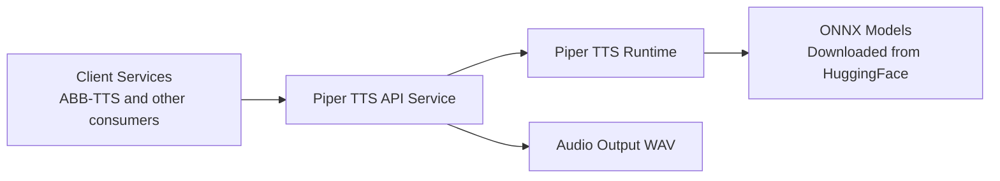

# Biblio TTS Server (Piper)

> Part of the [BiblioHub](https://github.com/vpoluyaktov/biblio-hub) application suite

A Python REST service for Piper TTS models, used as a core speech synthesis backend in the Biblio suite.

## Overview

Biblio TTS Server (Piper) provides a stable speech synthesis service for internal clients such as ABB-TTS.

Core purpose:

- Serve high-quality multi-language TTS over HTTP
- Expose voices/languages/models for client discovery
- Support scalable deployment in BiblioHub
- Provide access to Piper's extensive voice library (40+ languages, hundreds of voices)

## Architecture (High Level)



## Interfaces (Summary)

The service exposes endpoints for:

- TTS synthesis with speed control
- Voice listing and filtering
- Language/model discovery
- Health checks

Detailed request/response contracts are maintained in `README.md` and API code.

## Project Structure (Key Parts)

```
biblio-tts-server-piper/
├── Specification.md
├── README.md
├── src/                 # FastAPI app, routers, and TTS services
├── tests/               # API and service-level tests
└── docker/              # Container and stack deployment assets
```

## Key Differences from Silero TTS

1. **Model Format**: Uses ONNX models instead of PyTorch
2. **Voice Library**: Access to 40+ languages with hundreds of voices
3. **External Binary**: Requires Piper executable (included in Docker)
4. **Model Download**: Models downloaded from HuggingFace on-demand
5. **Speed Control**: Direct speed multiplier (0.5x - 2.0x)
6. **No SSML**: Piper doesn't support SSML tags
7. **Multi-Speaker**: Native support for multi-speaker models

## Current State

**Service status: Initial Implementation**

- ✅ Core API structure following Silero TTS pattern
- ✅ Voice discovery and model management
- ✅ TTS synthesis with Piper integration
- ✅ Web UI for testing
- ✅ Docker containerization
- ⏳ Integration into BiblioHub stack (pending)
- ⏳ Production testing and optimization
- ⏳ Model caching and preloading verification

## Development Priorities

1. Integration into BiblioHub Docker Swarm stack
2. Production testing with various models and languages
3. Performance optimization for model loading
4. Observability and monitoring integration
5. Compatibility testing with ABB-TTS
6. Model download and caching optimization

## Implementation Notes

### Piper Integration

The service integrates with Piper TTS via subprocess calls to the `piper` executable. Models are downloaded from HuggingFace on first use and cached locally.

### Model Management

- Models are identified by keys like `en_US-lessac-medium`
- Model metadata is fetched from HuggingFace voices.json
- ONNX models and config files are cached in `PIPER_CACHE_DIR`
- Served models can be filtered via `PIPER_SERVED_MODELS` environment variable

### Voice ID Format

Voice IDs follow the pattern: `piper:model_key` or `piper:model_key#speaker_id`

Examples:
- `piper:en_US-lessac-medium` (single-speaker model)
- `piper:en_US-libritts_r-medium#0` (multi-speaker model, speaker 0)

## Contribution Guidance

- Keep this file strategic and high-level
- Put endpoint examples, full configs, and deployment commands in `README.md`
- Update **Current State** and **Development Priorities** when capabilities change

---

*Last updated: 2026-03-04*
